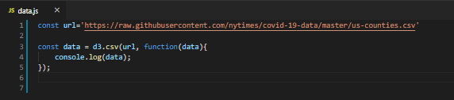
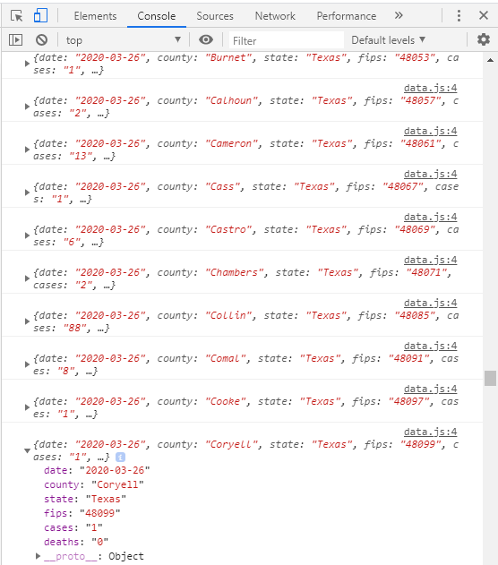
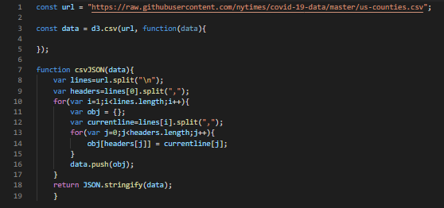

# Vision  
**Create dashboard of U.S. Map**  
- HTML maps
- States colored by d3 min/max valued by "cases" (choropleth)  
- U.S. map has drop-down select by day with filtered data shown  
- U.S. map has hover-on state show data of selected day
- On-click each state will take you to specified state by county   
- Counties colored by d3 min/max valued by "cases" (choropleth)  
- Each state by county map has drop-down select by day with filtered data shown  
- Each state has hover-on county show data of selected day
- Each state by county map has back-button to U.S. map  
    - **note:** California is active for example of drop-down filter and hover

**To-do list**  
- Counties colored by d3 min/max valued by "cases" (choropleth)
    - color by d3 min/max should be dynamic. In the main.js code.  
**note:** main.js is located in *static\counties\static\js\data.js*
- Get data (live feed would be perfered, however, found csv. [here](https://github.com/datasets/covid-19) and [here](https://github.com/nytimes/covid-19-data))
    - **note** current data is in *static\counties\static\js\data.js*. **Only set up for California at this time**. Have csv for all U.S. Counties to upload after color by d3 is completed.  
    
   # The data is being read in by this code in data.js  
   ## **NOTE**. I have not pushed this to the repo
    
      
    
    # It shows in the console  
    
      
    
    #### however, an error is printing that data is not a function on line 8 of main.js when a county is hovered on. I believe the problem is because it is csv, not json. Even though it is being printed on the console as objects. The main.js code would have to be reconfigured for csv... or figure out how to convert the csv to json. I was reading on jsonify and CSVToJSON. jsonify is more comprehesive to me. However, CSVToJSON code is a lot less. Requires downloading nodes(npm).  
    
    This replacement for a data source in promising.Console.log(data) shows the data coming in as csv. However, there is a disconnect in the json conversion. Also, will have to tweak **main.js** code after this feed works. **Data will have to be filtered by 'state'** after it is filtered by 'date' and before it is filtered by 'county'.  
    
    

  

View deployment [here](https://shannon-goddard.github.io/COV19MAP/)
